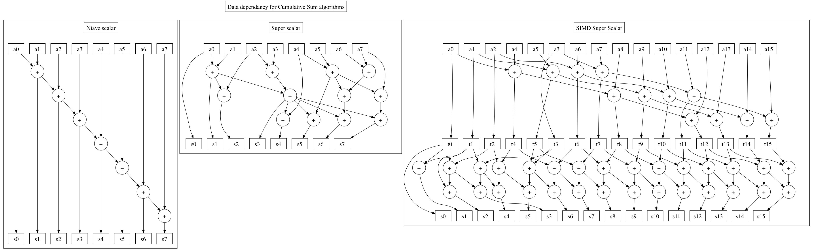

How to compute a cumulative sum faster.
=======================================

I've more than a few times written a program that I wished ran faster and after running it through a profiler found that in spent a large proportion of its time computing a cumulative sum. Most often this is part of a function that samples values from a multinomial distribution like so:

    int sample_multinomial(float *ps, int n)
    {
      /* Choose and return an integer i such that 0 <= i < n with probability
      	 proportional to ps[i] */
      in_place_cumulative_sum(ps, n);
      float total_probability_mass = ps[n - 1];
      float sample_point = ((float)rand() / (float)RAND_MAX) * total_probability_mass;
      int i = binary_search_for_insertion_point(ps, sample_point);
      return i;
    }

The cumulative sum operation is hard to do quickly because every value in the result seems to depend on the result value to its immediate left. Modern CPUs have many functional units on them and can compute multiple additions per clock cycle so long as those additions are not dependant on each other. On a recent Intel CPU, it takes 3 clock cycles before the result of adding two floats can be used to add in another instruction, but a new add operation can be started every clock cycle( [source](http://www.agner.org/optimize/instruction_tables.pdf) ). These different dimensions of speed are latency and throughput. Moderm CPUs also come with SIMD instructions which can do 2 or 4 or 8 or so addition operations at a time provided that all the inputs and outputs can be arranged in neatly aligned registers, and similarly these SIMD instructions can be started every x cycles but each takes y cycles to complete where x < y.

If we only needed the total sum, it would be obvious that we can divide that up and compute different parts in parallel. We can treat every value in the result of the cumulative sum as the total sum of all the previous input elements and divide up those total sums to turn the cumulative sum into something that can take advantage of the many functional units of modern CPUs. The increase in the total number of addition operations done can be bounded by sharing intermediate sums, forming networks of adders like so:

(The graph was created with graphvis/dot. I know it's not super neat, but it's better than if I had drawn a bunch of boxes and arrows myself.)

We can apply such a network to a larger array by computing in network sized chunks, adding the previous grand total to the first element of the next chunk before advancing.

It is important to note that doing more addition operations means more rounding errors, so numerical stability should be considered before applying these ideas.

The program in cumsum.c has three functions in it for computing cumulative sums, corresponding to the three networks in the above graphs. It tests those functions for performance and stability with various sizes trying to minimize unfair advantages. It is pretty well commented. I compiled it like so:
    gcc -std=c99  -march=corei7 -O4 cumsum.c
You may need to change the -march parameter to work on your machine. The program does require an x86 CPU with at least SSE3, but that should include most PCs and MACs these days. I used gcc 4.7.3 installed via macports. It took a little tinkering to make the compiler accept all the intrinsics that I tried, but mostly it was just getting the latest gcc, including the catch-all header, and telling the compiler to expect better than a 386.

The results look approximately like this:

    $ gcc -std=c99  -march=corei7 -O4 cumsum.c
    $ time ./a.out
    ...
    Benchmarking cumulative sums.

    Vector length: 262144
                niave:       583243 cycles per iteration,   0.450049 elements per cycle,   0.000000 avg error,   0.025745 avg sum error
         super scalar:       330901 cycles per iteration,   0.794046 elements per cycle,   0.005373 avg error,   0.016364 avg sum error
    super scalar simd:       239583 cycles per iteration,   1.095684 elements per cycle,   0.005688 avg error,   0.013236 avg sum error

    Vector length: 131072
                niave:       291544 cycles per iteration,   0.450096 elements per cycle,   0.000000 avg error,   0.003936 avg sum error
         super scalar:       166724 cycles per iteration,   0.789967 elements per cycle,   0.001515 avg error,   0.003951 avg sum error
    super scalar simd:       119678 cycles per iteration,   1.099793 elements per cycle,   0.002030 avg error,   0.004263 avg sum error
    ...
    Vector length: 256
                niave:          620 cycles per iteration,   0.413354 elements per cycle,   0.000000 avg error,   0.000000 avg sum error
         super scalar:          375 cycles per iteration,   0.684209 elements per cycle,   0.000000 avg error,   0.000000 avg sum error
    super scalar simd:          312 cycles per iteration,   0.821629 elements per cycle,   0.000000 avg error,   0.000000 avg sum error

    Vector length: 128
                niave:          334 cycles per iteration,   0.384068 elements per cycle,   0.000000 avg error,   0.000000 avg sum error
         super scalar:          214 cycles per iteration,   0.599701 elements per cycle,   0.000000 avg error,   0.000000 avg sum error
    super scalar simd:          199 cycles per iteration,   0.646830 elements per cycle,   0.000000 avg error,   0.000000 avg sum error
    ...
